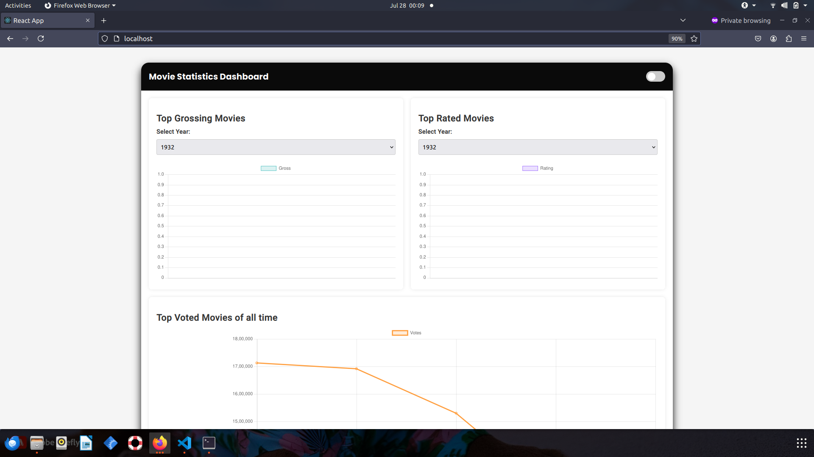
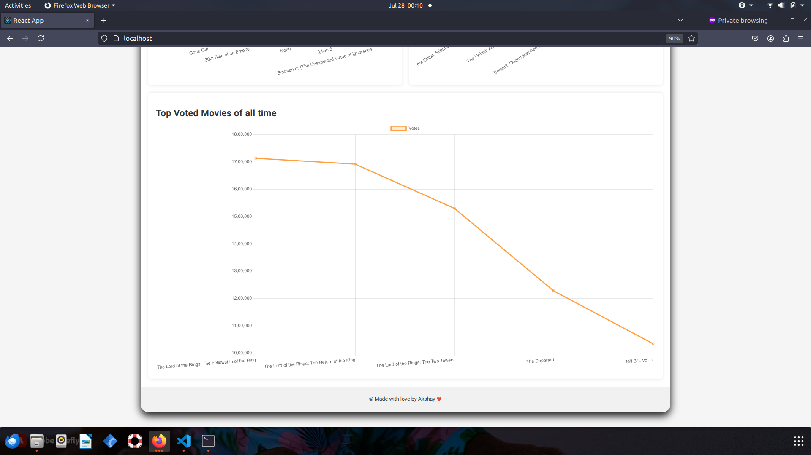
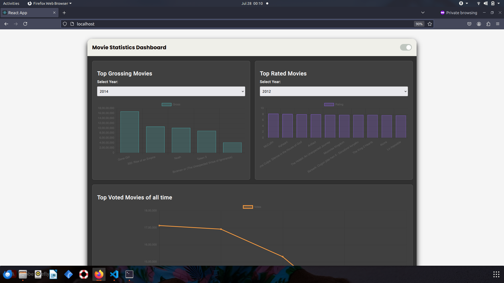
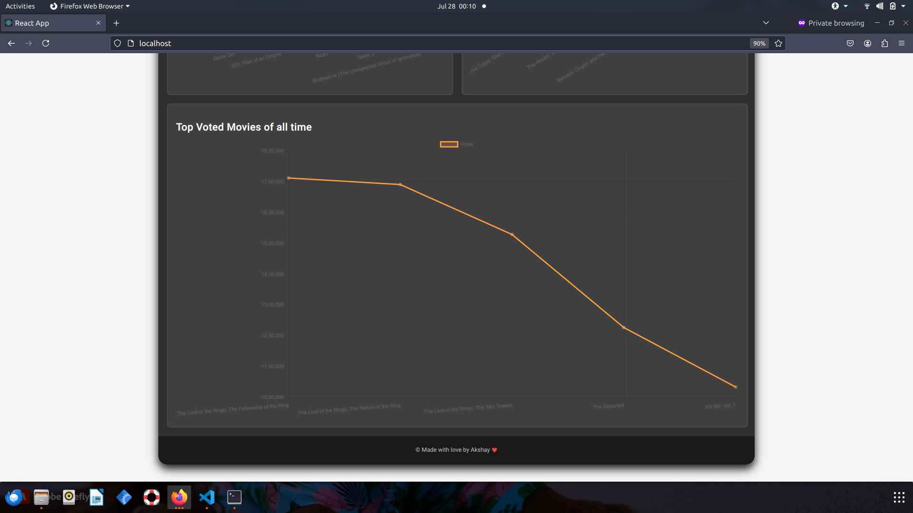

# Movie Statistics Dashboard

This project is a Movie Statistics Dashboard that displays top grossing, top rated, and top voted movies. The stack includes a Django backend and a React frontend.

## Technologies and Stack

### Data Preprocessing

- **Docker**: Containerization platform

### Frontend

- **React**: JavaScript library for building user interfaces
- **CSS**: Styling
- **Axios**: Promise-based HTTP client for making requests to the backend

### Backend

- **Django**: High-level Python web framework
- **Django REST Framework**: Toolkit for building Web APIs
- **SQLite**: Lightweight database for development

### DevOps

- **Docker**: Containerization platform
- **Docker Compose**: Tool for defining and running multi-container Docker applications

## Prerequisites

Before you begin, ensure you have the following installed on your machine:

- Docker
- Docker Compose

## Installation

Follow these steps to set up and run the application:

### 1. Clone the Repository

Clone the repository to your local machine using the following command:

```sh
git clone https://github.com/Akshaymitra/movie_dashboard.git
cd movie_dashboard
```


### 2. Build and run the stack using the following command :

```sh
docker compose up --build
```

This command will:

* Pull the necessary images
* Build the Docker images if there are any changes
* Start the backend and frontend containers


### 3. Access the Application

Once the containers are up and running, you can access the application in your browser:

* Frontend: [http://localhost](http://localhost)
* Backend: [http://localhost:8001](http://localhost:8001)


### 4. API Endpoints

The backend provides the following API endpoints:

* `/api/top-gross-movies/`
* `/api/top-rated-movies/`
* `/api/top-voted-movies/`
* `/api/available-years/`


### 5. Stopping the Application

```sh
docker compose down
```


### 6. Important Guidelines

- In windows check your firewall settings to see if the necessary ports are opened . (80,8001)
- This manual assumes that Docker and Docker Compose are installed in the respective machine .
- If using Ubuntu or any Debian distribution , consider using the bash commands using sudo to prevent permission denial for any command .

### 7. Sample Screenshots 








